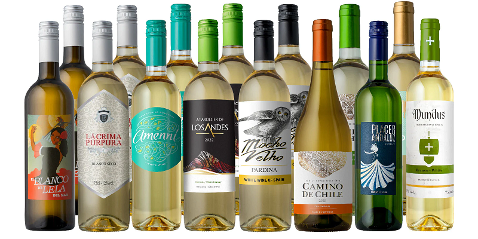

## Overview

This Streamlit app predicts the quality of wine based on various features. It includes data visualization, model training, and evaluation metrics.

## Table of Contents
...
...

## Demo

Visit the [Wine Quality Prediction App](https://sunelee.github.io/wine_quality/) for a live demo.

## Getting Started
...
...

1. **Clone Repository:**

    ```bash
    git clone https://github.com/Sunelee/wine_quality.git
    cd wine_quality
    ```

2. **Install Dependencies:**

    ```bash
    pip install -r requirements.txt
    ```

## App Structure
...
...

### Run Locally

```bash
streamlit run wine_quality.py
